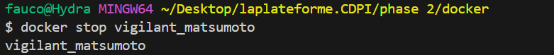

# Docker Job 5 : Tic Tac Toe avec Persistance des Données

Exo de conteneurisation d'un jeu de Morpion 
## Fichiers Clés

- **Dockerfile** : Configuré pour Apache/PHP, avec préparation du dossier `/var/www/data` pour le volume.
- **save.php** : Script PHP modifié pour écrire les résultats dans le volume (`/var/www/data/results.json`).
- **results.json** : Fichier stockant l'historique des gagnants.

## Étapes de Déploiement

### 1. Construction de l'Image
Commande : `docker build -t job5-tic-tac-toe .`

### 2. Création du Volume
Nous créons un volume nommé `game-results` pour stocker les données de façon persistante.
Commande : `docker volume create game-results`

### 3. Lancement du Conteneur
Le conteneur est lancé en liant le volume au dossier de données interne.
Commande : `docker run -d -p 8081:80 -v game-results:/var/www/data job5-tic-tac-toe`

### 4. Application en Fonctionnement
Le jeu est accessible via `http://localhost:8081`.

### 5. Vérification de la Persistance & Résultats
Nous pouvons vérifier que le fichier `results.json` est bien créé et rempli à l'intérieur du volume.

**Visualisation du contenu du volume :**

**Lecture du fichier JSON depuis le terminal :**
Commande : `docker exec -it <id> cat //var/www/data/results.json`

**Aperçu du fichier JSON :**

### 6. Vérifications Supplémentaires
Vérification que le volume est bien monté et opérationnel.

### 7. Arrêt du Conteneur
Nettoyage et arrêt de l'environnement.

